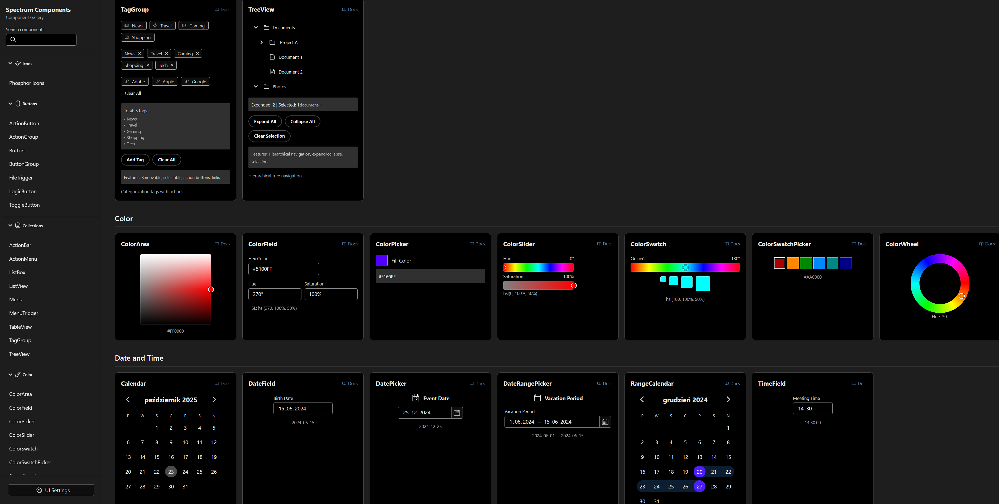

# React Spectrum Component Showcase

Interactive showcase of Adobe React Spectrum components with comprehensive demos, theme switching, responsive design, and accessibility features.

**Live Demo:** https://dariuszsikorski.github.io/react-spectrum-showcase/


<a href="https://dariuszsikorski.github.io/react-spectrum-showcase/">
  
</a>


**Author:** [Dariusz Sikorski](https://dariuszsikorski.pl/) • [GitHub](https://github.com/dariuszsikorski) • [LinkedIn](https://www.linkedin.com/in/dariusz-sikorski-56281b3a/) • [Phicasso.ai](https://phicasso.ai/)

---

## Overview

This showcase demonstrates Adobe React Spectrum components with comprehensive demos, theme switching (light/dark), responsive design, and accessibility features. Features include interactive component gallery, theme context management, responsive UI detection, and dynamic scaling. Responsive detection automatically injects `.is-mobile` and `.is-desktop` classes. All components are wrapped in Adobe Spectrum Provider for theme support. Icons use Phosphor library with universal integration pattern.

---

## Responsive UI System

Built-in responsive detection and scaling system:

- **Scale Control:** 50%-200% slider with preset buttons
- **Dynamic Breakpoints:** Adjust with scale (e.g., 1200px at 125% scale)
- **Device Detection:** Automatic mobile/desktop mode detection
- **Body Classes:** `.is-mobile` and `.is-desktop` injected on resize
- **Persistence:** UI scale and mode saved to localStorage

Hook implementation in `src/hooks/useResponsive.ts` manages state subscription and updates.

---

## Icon Implementation

Icon handling follows universal pattern documented in `100_WORD_ESSENCE_GUIDES.md`. Key principles:

- **Wrapper Required:** Always use `<PhosphorIcon icon={...} />` component
- **Component Categories:** Different patterns for ActionButton (direct), ToggleButton (Flex wrapper), FileTrigger (nested Flex)
- **Gap Spacing:** Use `size-50` (4px) for icon+text compact layouts
- **Size Inheritance:** Icons inherit 16px default from IconContext

See `GUIDES.md` for implementation reference and TypeScript integration patterns.

---

## Project Structure

```
src/
  components/      # Reusable UI components
    Demos/        # 76+ React Spectrum component demos
    Grid/         # Grid layout components
    PhosphorIcon/ # Icon wrapper component
    Sidebar/      # Sidebar components
  contexts/       # Theme and responsive state management
  hooks/          # useResponsive, useDebounce, useDisclosureState
  utils/          # Helpers (color, storage, scrolling)
  assets/         # Static assets (images, icons)
  App.tsx         # Main application component
  main.tsx        # Application entry point
```

---

## Quick Start

Get up and running in seconds:

```bash
# Install dependencies
pnpm install

# Start development server
pnpm run dev

# Build for production
pnpm run build
```

**Available Commands:**
- `pnpm run dev` - Start Vite dev server (http://localhost:5173)
- `pnpm run build` - Build for production
- `pnpm run lint` - Run ESLint checks
- `pnpm run preview` - Preview production build

---

<!-- Deployment details were removed after enabling automated GitHub Pages. -->

## Dependencies

- **@adobe/react-spectrum** (^3.45.0) - Component library
- **@phosphor-icons/react** (^2.1.10) - Icon library
- **@spectrum-icons/workflow** (^4.2.25) - Adobe workflow icons
- **React** (^19.1.1) - UI library
- **Vite** (^7.1.7) - Build tool

---

## Technical Guidelines

Detailed technical patterns and troubleshooting documented in `GUIDES.md` covering: icon alignment, theme switching, component structure patterns, Spectrum integration mechanics, implementation strategies, and TypeScript integration.

---

## Components Showcased

Comprehensive gallery of 76+ React Spectrum components including: Provider (theme), ColorPicker, ColorEditor, Calendar, Button, Slider, ButtonGroup, Badge, ActionButton, ActionGroup, ToggleButton, FileTrigger, Menu, Dialog, ListView, TableView, Form fields, Accordion, Disclosure, TreeView, TagGroup, Popover, Tooltip, and many more.

All components wrapped in Provider with theme support, responsive design, and accessibility features.

---

## Author

**Dariusz Sikorski**  
Website: https://dariuszsikorski.pl/  
GitHub: https://github.com/dariuszsikorski  
LinkedIn: https://www.linkedin.com/in/dariusz-sikorski-56281b3a/  
Phicasso.ai: https://phicasso.ai/
